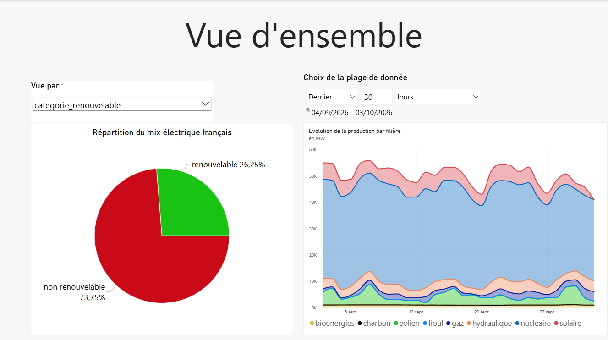
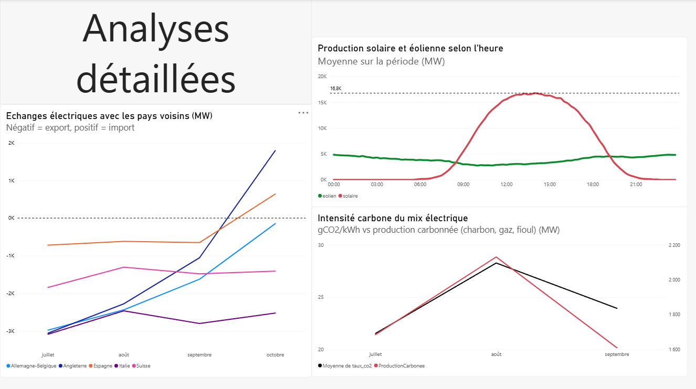

# ⚡Projet Eco2mix Pipeline — Suivi du mix électrique français en temps réel

Pipeline de données de bout en bout : collecte automatisée, stockage, analyse et visualisation des données de production et consommation électrique françaises, à partir de l'API temps réel de RTE (eco2mix).

## À propos

Ingénieur d'affaires en reconversion vers la Data Analytics, avec une expérience professionnelle dans l'analyse commerciale, le suivi client et les projets techniques. Ce projet est né de la volonté de construire un pipeline de données complet, de la collecte à la visualisation, sur un sujet technique qui fait écho à mon parcours initial dans l'électricité (courant fort/courant faible).

## 📊 Aperçu du dashboard

### Vue d'ensemble
Répartition du mix électrique (avec sélecteur dynamique : par filière, carboné/décarboné, ou renouvelable/non-renouvelable) et évolution de la production dans le temps.

### Analyse détaillée
Profil horaire solaire/éolien, échanges électriques avec les pays voisins, et intensité carbone du mix comparée à la production carbonée.

## 🏗️ Architecture du pipeline

### Mise en place initiale
1. **Constitution du socle de données** : un premier script Python a interrogé l'intégralité de l'historique disponible sur l'API RTE et exporté le résultat dans un fichier CSV.
2. **Création de la base** : une base PostgreSQL a été créée sur **Neon** (hébergement cloud gratuit), puis ce CSV y a été importé via DBeaver pour constituer l'historique initial. Les types de données ont ensuite été corrigés (`timestamptz`, `date`, `time`), et une contrainte d'unicité sur `date_heure` a été ajoutée pour garantir l'intégrité des données.
### Fonctionnement en continu
3. **Collecte automatisée** : le script `collecte.py` a été simplifié pour ne plus traiter que le relevé le plus récent disponible sur l'API, plutôt que tout l'historique.
4. **Automatisation cloud** : ce script s'exécute automatiquement toutes les 15 minutes via **GitHub Actions**, qui interroge l'API RTE puis **écrit directement la nouvelle ligne dans la base Neon** (avec gestion des doublons via `ON CONFLICT DO NOTHING`, au cas où aucune nouvelle donnée ne serait disponible). L'ensemble tourne dans le cloud, indépendamment de toute machine locale. Les identifiants de connexion à la base sont stockés en tant que **GitHub Secrets**, jamais en clair dans le code.
### Analyse exploratoire
5. **Analyse SQL** : avant de construire le dashboard, un ensemble de requêtes SQL a permis d'explorer et de valider les données (répartition par filière, renouvelable/carboné, profils horaires, détection d'anomalies, coefficients de variation...). Toutes les requêtes sont documentées et commentées dans [`analyses.sql`](analyses.sql).
6. **Visualisation** : dashboard **Power BI**, connecté directement à la base Neon (mode Import, actualisation manuelle à la demande).

## 🔍 Insights clés

### Remarque
La base de données se met à jour toutes les 15 min avec les derniers relevés de RTE. Cependant, l'échantillon de données disponible via l'API au moment de l'extraction initiale commençait aux relevés du 1er juillet 2026 à 00h00. La plage de données disponible pour les analyses s'étoffera donc avec le temps. Les observations suivantes concernent donc la production et la consommation à partir de l'été 2026. Il serait intéressant de refaire cette analyse une fois l'hiver passé pour observer la variation du parc électrique français selon les saisons.
### Observations
Les observations suivantes sont issues des requêtes SQL explorées dans [`analyses.sql`](analyses.sql), avant leur traduction en visuels Power BI :
- **Mix électrique français** : environ 70% de la production provient du nucléaire, pour une part décarbonée totale avoisinant 93% (nucléaire + renouvelables), contre seulement 7% de production carbonée (gaz, charbon, fioul).
- **Saisonnalité de la production nucléaire** : la production nucléaire baisse sensiblement entre juillet et octobre, cohérent avec les périodes de maintenance programmée des réacteurs, généralement planifiées en été lorsque la demande est plus faible.
- **Variabilité de la consommation vs des renouvelables** : la consommation électrique présente une variabilité relativement faible (coefficient de variation d'environ 13%), reflet d'un signal cyclique et prévisible. À l'inverse, la production éolienne affiche un coefficient de variation de 64%, illustrant sa nature intermittente et dépendante des conditions météorologiques.
- **Flux physiques vs échanges commerciaux** : les échanges commerciaux déclarés par pays ne correspondent pas exactement au flux physique mesuré aux frontières, un écart dû aux "flux en boucle" (loop flows) inhérents au réseau électrique européen fortement interconnecté. On remarque également que la France est grandement exportatrice d'électricité.
- **Intensité carbone** : le taux de CO2 du mix électrique suit de très près l'usage des énergies carbonées (charbon, gaz, fioul), confirmant visuellement et statistiquement le lien entre les deux indicateurs.

## 🛠️ Compétences démontrées

- **Python** : consommation d'API REST (`requests`), manipulation de données, connexion à une base de données (`psycopg2`), gestion sécurisée des identifiants (`python-dotenv`)
- **SQL** : requêtes d'agrégation (`GROUP BY`, CTE), statistiques descriptives (moyenne, écart-type, quartiles, détection d'outliers via la méthode IQR), jointures
- **Git / GitHub** : gestion de version, `.gitignore`, bonnes pratiques de commits
- **Cloud / DevOps** : automatisation via GitHub Actions, gestion de secrets, hébergement de base de données (Neon)
- **Power BI** : modélisation de données (transformation Power Query, format long vs large), DAX (mesures, paramètres de champ), choix entre mode Import et DirectQuery
- **Analyse de données** : interprétation métier des résultats (saisonnalité, intermittence des énergies renouvelables, nuance flux physiques/commerciaux), esprit critique face aux résultats inattendus

## ⚖️ Choix techniques et limites assumées

- **Import plutôt que DirectQuery** : le dashboard utilise le mode **Import** de Power BI (données rafraîchies manuellement) plutôt que DirectQuery. Cette dernière option aurait permis une mise à jour automatique sans intervention, mais nécessite que les transformations de données soient traduisibles en SQL natif ("query folding") — ce qui n'est pas le cas de l'opération de "dépivotage" (Unpivot) utilisée pour passer d'un format large à un format long (utile pour les filtres par filière, etc). Une migration propre impliquerait de déplacer cette logique dans des vues SQL côté base de données.
- **Pas de publication en ligne** : le dashboard n'est pas publié publiquement via Power BI Service, qui nécessite un compte professionnel/scolaire (non disponible dans le cadre de ce projet personnel). Le dashboard est donc présenté ici via des captures d'écran.
- **Ordre de l'API non garanti** : l'API RTE ne garantit pas que ses résultats soient triés chronologiquement par défaut. Le script détermine donc lui-même le relevé le plus récent (via `max()` sur `date_heure`), plutôt que de faire confiance à un paramètre de tri (`sort`) qui s'est avéré peu fiable.

## 🚀 Reproduire le projet

Le code est organisé ainsi :
- [`collecte.py`](collecte.py) — script de collecte et d'insertion en base
- [`analyses.sql`](analyses.sql) — requêtes d'analyse exploratoire
- [`.github/workflows/collecte.yml`](.github/workflows/collecte.yml) — automatisation via GitHub Actions
- [`dashboard_eco2mix.pbix`](dashboard_eco2mix.pbix) — dashboard Power BI

Une infrastructure personnelle (PostgreSQL + identifiants) est nécessaire pour exécuter le pipeline de bout en bout.